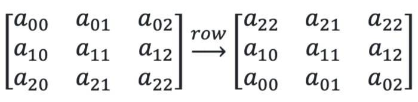
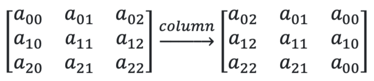
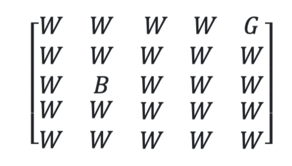

  
 Table Of Contents 

  <ul>
    <li> <a href="#question---1">Question - 1</a></li>
     <li> <a href="#question---2">Question - 2</a></li>
     <li> <a href="#question---3">Question - 3</a></li>
     <li> <a href="#question---4">Question - 4</a></li>
     <li> <a href="#question---5">Question - 5</a></li>
     <li> <a href="#question---6">Question - 6</a></li>
     <li> <a href="#question---7">Question - 7</a></li>
     <li> <a href="#question---8">Question - 8</a></li>
     <li> <a href="#question---9">Question - 9</a></li>
     <li> <a href="#question---10">Question - 10</a></li>
     <li> <a href="#question---11">Question - 11</a></li>
     <li> <a href="#question---12">Question - 12</a></li>
     <li> <a href="#question---13">Question - 13</a></li>
     <li> <a href="#question---14">Question - 14</a></li>
     <li> <a href="#question---15">Question - 15</a></li>
     <li> <a href="#question---16">Question - 16</a></li>
     <li> <a href="#question---17">Question - 17</a></li>
     <li> <a href="#question---18">Question - 18</a></li>
    
    </ul>

## Question - 1 
A data entry operator has a faulty keyboard. The keys 0 and 1 are very unreliable. Sometimes they work, sometimes they don't. While entering phone numbers into a database, the operator uses the letter 'l' as a replacement for 1 and 'o' as a replacement for 0 whenever these binary digits let him down. Both 'l' and 'o' are in lower case.

---

Accept a ten-digit number as input. Find the number of places where the numbers 0 and 1 have been replaced by letters.If there are no such replacements,print the string `No mistakes`.If not, print the number of mistakes (replacements) and in the next line, print the correct phone number.

## Question - 2
A sequence of integers of even length is said to be `left-heavy`  if the sum of the terms in the left-half of the sequence is greater than the sum of the terms in the right half. It is termed `right-heavy`
if the sum of the second half is greater than the first half. It is said to be `balanced` if both the sums are equal.

---
Accept a sequence of comma-separated integers as input. Determine if the sequence is `left-heavy`, `roght-heavy` or `balanced` and print this as the output.

## Question - 3
A square matrix `M` is said to be:

* `diagonal`: if the entries outside the main-diagonal are all zeros
* `scalar`: if it is a diagonal matrix, all whose of diagonal elements are equal
* `identity`: if it is a scalar matrix, all of whose diagonal elements are equal to 1

---
Accept a matrix `M` as input from the console. The first line of input will have `n`, the number of rows in the matrix. Each of the next n lines will be a sequence of comma-separated integers that stands for one row of the matrix.

Your task is to output the type of matrix and should be one of these
strings: `diagonal`, `scalar`, `identity`, `non-diagonal`.

**Note**: The type you output should be the most appropriate one for the given matrix.

## Question - 4
There are five boxes arranged from left to right. You keep adding a variable number of coins sequentially in each box. Start from box-1 and keep going right. Once you reach the last box, head back to box-1 and then keep adding coins. In any given turn, the number of coins added to a box is always less than 10.

---
Find the box which has the maximum number of coins. If there are two boxes which have the same maximum number of coins, output the smaller of the two box numbers. The sequence of coins is represented by a string. For example, if the input is `3972894910`, this is how coins are added:
| Box | Coins |
|:---:|:----------:|
| 1   | 3 + 9 = 12 |
| 2   | 9 + 4 = 13 |
| 3   | 7 + 9 = 16 |
| 4   | 2 + 1 = 3  |
| 5   | 8 + 0 = 8  | 

In this case, `3` is the output as box-3 has the maximum number of coins in it.

## Question - 5
Accept a positive integer `A` as input and print the dimensions of all rectangles with integer sides that have an area equal to `A`. Treat a square as a rectangle with equal sides. In each line, print the dimension of one rectangle as a pair of comma separated integers `a,b`
— such that a ≤ b. The
dimension of one rectangle as a pair of comma separated integers —
rectangle with sides a and b should be printed exactly once. That is, `(a,b)` and `(b,a)`represent the same rectangle.

## Question - 6
Sort a list `L` of items in non-decreasing order and store it in the list `soretd_L`. All items in the list are of the same type. This common type could be `int`, `float` or `str`. The list `L` is already given to you.

**Note**: You must write your solution within the function `sort`. Indent all your code by four spaces.

## Question - 7
Accept a positive integer `n` as input and find the print the smallest integer that is divisible by all the
integers in the range [1,n], endpoints inclusive.

## Question - 8
Consider a sequence of words. A sub-sequence is a subset of consecutive words in this sequence. For example, given the following sequence:

1. one,two,order
2. real,long,tight,tree
3. cool
4. one,two,order,real,long,tight,tree,cool,lot,trouble

**Note**: `one,lot` does not form a sub-sequence as far as this problem is concerned. Also (3) and (4) are valid sub-sequences even though they are quite trivial in nature.

---
A sub-sequence is said to have the antakshari property if the last letter of every word in the sub- sequence is equal to the first letter in the next word. For example, in the above sequence, we have the following sub-sequences with this property:

1. `cool,lot` 
2. `cool,lot,trouble `
3. `two,order,real`
4. `two,order,real,long`

Your task is to find the length of the longest sub-sequence with the antakshari property. In the above sequence, the longest sub-sequence with this property has length 4.

---
Accept a sequence of comma separated words as input and print the length of the longest sub- sequence with the antakshari property. All words in the sequence will be in lower case.

## Question - 9
This problem is about reversing a square matrix along row or column. Reversing a matrix along the rows is to perform the following operation:

Reversing a matrix along the columns is to perform the following operation:

---
The first line of the input will be an integer `n`, which denotes the dimension of the square matrix. Each of the next `n` lines in the input will have a sequence of `n` comma-separated integers. The last line in the input will be one of these two words: `row` or `column`. If it is `row`, then reverse the matrix along the `row`, else, reverse it along the `column`.
Print the reversed matrix as output: each line should contain one row of the matrix as a sequence of comma-separated integers.

## Question - 10
A string `str_1` is a substring of another string `str_2` , if `str_1` is present as a sequence of consecutive characters in `str_2`. For example, `got` is a substring of `gottingen`,
whereas `got` is not a substring of `goat`.

--
Accept a sequence of comma separated words as input. Print that word in the sequence which is a substring of every other word in the sequence.
If you do not find any word that is a common substring of all words in the sequence, print `None`. Assume that all the words will be in lower case.

## Question - 11
A number is called a `double palindrome` if both the number and its square are palindromes. For
example, 11 is `double palindrome` as both 11 and 121 are palindromes. Accept a positive
integer `n` as input and print all the double palindromes less than or equal to `n` in ascending order.

## Question - 12
Three rectangular matrices `A`, `B` and `C` are provided to you. You need to compute the product of these three matrices: A×B×C. Store the results of this matrix multiplication in a matrix named as `prod`. Each of these matrices is a list of lists.

---
You do not have to accept input from the console or print the output to the console. You just have to write your code within the function `multiply`. Make sure to indent all your code by four spaces.

## Question - 13
`para` is a sequence of space-separated words. All words will be in lower case. There will be a single space between consecutive words. The string has no other special characters other than the space.

---
Write a function named `exact_count` that accepts the string `para` and a positive integer `n` as arguments. You have to return `True` if there is atleast one word in `para` that occurs exactly `n` times, `False` otherwise.

## Question - 14
Your task is to do simple word problems such as this: `one plus two plus three`. The answer is 6.

---
Accept a sequence of space-separated words as input. Each word is either a digit from "zero" to "nine" (endpoints inclusive) or one of the two operands: "plus" or "minus". The operands and operators alternate in the sequence. In other words, no two consecutive words will be of the same type.
You have to find the solution of this arithmetic problem and print the answer as an integer. Evaluate the expression without introducing brackets anywhere, i.e., `minus one plus two minus three` is just −1+2−3.

## Question - 15
The price of a steel rod is generally a simple function of its length. However, requirements of companies also influence the price. If you are selling rods to a company that has a preference for short rods and doesn't use too many long rods, the price distribution could look like this:

| Rod-Length | Price |
|:---:|:----------:|
| 1   | 10 |
| 2   | 20 |
| 3   | 20 |
| 4   | 5  |
| 5   | 3  | 

If you have a rod of length 5 meters, you would make a lot more money by cutting the rod and selling it as two rods — one of length 3 meters and another of length 2 meters — than selling a single rod of length 5 meters.

---
Your task is to accept the length of a rod and the price distribution as inputs. You are allowed to make at most one cut of the rod. Find the maximum revenue that you can obtain. Assume that you can only sell rods of integer lengths.

First line of input is the length of the rod, `L`. The second line is a sequence of L comma separated integers that corresponds to the selling prices of rods of lengths `(1,2,3,⋯,L−1,L)`. Print the maximum revenue that can be obtained with at most one cut of the given rod.

## Question - 16
Write a recursive function named `subsets` that accepts a non-empty list of distinct integers `L` as argument. It should return the list of all subsets of `L`.

1. Each subset is to be represented as a list of numbers.
2. The order in which you arrange the elements within a subset doesn't matter. For `L = [1, 2, 3]`, `[1, 3]` and `[3, 1]` represent the same subset.
3. The order in which you append the subsets to the returned list doesn't matter.
4.  The empty list is a subset for all lists.

## Question - 17
Consider an irrational number in the following form:
$$
a+b\sqrt{p}
$$

`a`,`b` and `p` are integers. Additionally, `p` is a prime. For all n≥1, it is known that there is a unique tuple
of integer `(x,y,p)` such that:
$$
(a+b\sqrt{p})^n = x + y\sqrt{p}
$$

For example:
$$
(2+3\sqrt{5})^n = 49 + 12\sqrt{5}
$$

---
Write a function named `compute`  that accepts the integers `a`, `b`, `p` and `n` as arguments and returns a tuple of integers `(x,y)`.

---
You do not have to accept input from the user or print output to the console. You just have to write the function definition.

## Question - 18
Consider a grid-world that is inhabited by an ant `(BLUE)`. The ant can move only in two directions: `UP` or `RIGHT`. The ant has sensed the presence of a source of food somewhere in the grid. Your task is twofold:

1. Determine if the ant can reach the food source.
2. If it can, find out the number of steps it has to take.

For example, in the grid-world on the left, the ant can reach the food source in five steps. On the right, it can't.

---
The grid-world is represented as a matrix of strings: `B` stands for the initial position of the ant, `W` stands for the empty cell
and `G` stands for the food source. For example, the grid-world on the left is represented as

---
Write a function named `is_reachable` that accepts a `n` times `n` matrix of strings named `grid` as argument. Return  `(True, steps)` 
if the ant can reach the food source, where `steps` is the number of steps the ant needs to take. If it can't reach the food source, return `(False, None)`
